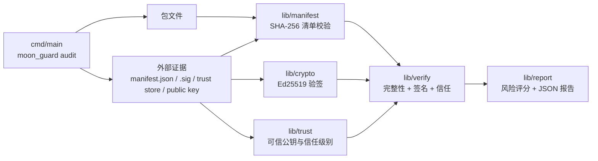

# MoonGuard 项目申报书

## 一、项目名称

**MoonGuard** — MoonBit 供应链安全工具链

## 二、项目简介

MoonGuard 是用纯 MoonBit 实现的供应链安全工具链：Ed25519 包签名/验签、SHA-256 清单校验、JSON+PEM 可信公钥管理、Levenshtein 与同形（homoglyph）双模式 typosquat 检测、CVSS 风格 0–10 风险评分的 JSON 安全审计报告，附带 9 子命令的 `moon_guard` CLI。CLI `audit` 基于外部 manifest、detached signature、公钥和 trust store 审计；关键证据缺失时会显式失败，避免对临时生成数据自验通过。

## 三、项目方向与适用场景

方向：MoonBit 包供应链安全（来源可信 + 清单完整性 + typosquat 检测）。适用：发布前签名验证、安装前审计、CI/CD 集成、批量仓库风险扫描。

## 四、核心功能

- `lib/manifest`：纯 MoonBit SHA-256、清单生成/校验
- `lib/crypto`：Ed25519（RFC 8032）+ SHA-512 + field 算术
- `lib/trust`：Full/Partial/Untrusted 分级 + PEM/JSON 持久化
- `lib/verify`：audit 全链路（integrity + signature + trust）+ typosquat 严格检测
- `lib/report`：0–10 风险评分 + JSON 安全报告
- `cmd/main`：9 子命令 CLI（keygen/sign/verify/trust/typosquat/manifest/hash/audit/version）

## 五、技术架构图

## 六、项目属性

**原创项目** — SHA-256 / Ed25519 / Levenshtein 均按公开 RFC 与规范独立实现，不移植自其他项目，无闭源代码。

## 七、GitHub / Gitlink 仓库

- GitHub：`https://github.com/chenzehaoo/MoonGUARD`
- Gitlink：`https://gitlink.org.cn/sharp/MoonGuard`
- 默认分支：`main`

## 八、交付物

核心 lib + CLI + 97+ 单元/端到端/fuzz/bench 测试 + 跨平台 CI（ubuntu/macos/windows × wasm/native）+ `examples/basic_audit` 可复现 demo。
