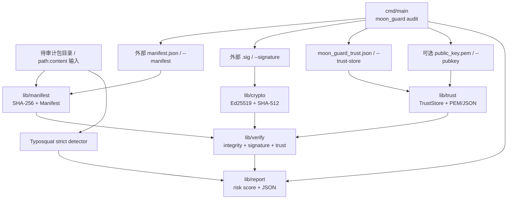

# MoonGuard（中文）

MoonBit 供应链安全工具链。

## 项目简介

MoonGuard 是一个**纯 MoonBit** 实现的供应链安全工具链，提供：

- **清单完整性** — 文件内容的 SHA-256 哈希（纯 MoonBit 实现，无外部加密库）
- **Ed25519 签名** — RFC 8032 sign/verify，含 field 算术与 SHA-512
- **可信密钥库** — 内存存储 + 三级信任（Full / Partial / Untrusted），支持 JSON 与 PEM（RFC 7468）持久化
- **审计流水线** — `verify_package` / `audit_package` 把完整性、签名、可信度三件事合并到一次调用；CLI `audit` 基于真实外部 manifest、签名和信任库审计，缺失关键证据会报告失败
- **Typosquat 检测** — Levenshtein 距离 + 同形（homoglyph）严格模式，支持批量汇总
- **安全报告** — `SecurityReport` 含风险等级、0–10 CVSS 风格风险评分、JSON 导出
- **CLI** — `moon_guard` 可执行文件，含 `keygen` / `sign` / `verify` / `trust` / `typosquat` / `manifest` / `hash` / `audit` / `version` 九个子命令

## 仓库结构

```
moon_guard/
├── lib/                  # 核心库
│   ├── manifest/         # 清单 + SHA-256
│   ├── crypto/           # Ed25519 + SHA-512
│   ├── trust/            # 可信密钥库（PEM/JSON 持久化）
│   ├── verify/           # 审计流水线 + typosquat
│   └── report/           # 安全报告（含风险评分）
├── cmd/main/             # CLI 入口
├── examples/             # 可运行示例（examples/basic_audit）
├── moon.mod              # 模块清单
└── LICENSE               # Apache-2.0
```

## 技术架构图



## 库 API（lib/）

### lib/manifest — 清单与 SHA-256
- `FileEntry` — `{ path, content }` 输入结构
- `FileHash` — `{ path, hash, size }` 单文件记录
- `Manifest` — 完整包清单
- `sha256()` / `hash_string()` — 纯 MoonBit SHA-256
- `generate_manifest()` — 从 entries 生成清单
- `verify_manifest()` — 校验 entries，返回不匹配路径列表
- `manifest_to_json()` / `manifest_summary()` — 序列化 / 摘要
- `take_chars_()` / `slice_chars_()` — 内部 string 切片 helper

### lib/crypto — Ed25519
- `KeyPair` — `{ public_key, secret_key }`
- `Signature` — `{ r, s }`
- `generate_keypair(seed)` — 从 64 字符十六进制种子生成确定性密钥对
- `sign(message, keypair)` — 签名 UTF-8 消息
- `verify(message, signature, public_key)` — 验证签名
- `signature_to_hex()` — 把 `r||s` 拼成 128 字符 hex

### lib/trust — 可信密钥库
- `TrustLevel` — `Full` / `Partial` / `Untrusted`
- `TrustedKey` — 单条密钥记录
- `TrustStore` — 内存密钥库
  - `add_key()` / `remove_key()` / `get_key()` / `is_trusted()` / `find_by_owner()` / `key_count()`
  - `list_all()` — 防御性快照
  - `replace_all()` — 整体替换（用于恢复）
- `validate_public_key_format()` — 64 字符 hex 校验
- `normalize_public_key()` — 把混合大小写 hex 折叠成小写
- `public_key_to_pem()` / `public_key_from_pem()` — RFC 7468 风格 PEM 信封
- `trust_store_to_json()` / `trust_store_from_json()` — 带版本号的 JSON 序列化

### lib/verify — 审计 + typosquat
- `VerifyResult` — `{ package_name, is_valid, signature_ok, trust_status, errors, warnings }`
- `verify_package()` — 单签名验签
- `audit_package()` — 完整审计（integrity + signature + trust）
- `detect_typosquat()` — Levenshtein ≤ 2 + 分隔符归一化
- `detect_typosquat_strict()` — 加入同形检测（`1odash`、`Iodash` 等）
- `batch_typosquat_check()` — 批量检测
- `typosquat_summary()` — 按 suspect 聚合

### lib/report — 安全报告
- `RiskLevel` — `Critical` / `High` / `Medium` / `Low` / `Info`
- `ReportStatus` — `Pass` / `Warning` / `Fail`
- `Finding` — 单条发现
- `TyposquatSummaryEntry` — per-suspect 汇总
- `SecurityReport`
  - `add_finding()` — 自动推导状态
  - `recompute_score()` — 把累计风险评分 clamp 到 `[0, 10]`
  - `summary()` — 人类可读文本
  - `report_to_json()` — JSON 序列化
- `make_finding()` — Finding 构造器

## CLI 使用

`cmd/main` 编译为 `moon_guard` 可执行文件。用 `moon run` 调用：

```bash
moon run cmd/main -- <command> [args]
```

子命令一览：

| 子命令 | 说明 |
|--------|------|
| `keygen [seed]` | 生成 Ed25519 密钥对（缺省用内置 demo seed）+ PEM 信封 |
| `sign <msg> <seed>` | 用 hex seed 签名 UTF-8 消息 |
| `verify <msg> <sig_hex> <pubkey>` | 验证 Ed25519 签名 |
| `trust add <key_id> <pubkey> <owner> [level]` | 添加可信密钥（level = full / partial / untrusted） |
| `trust list` | 列出所有可信密钥 |
| `trust remove <key_id>` | 删除可信密钥 |
| `typosquat <name> <known...>` | 严格 typosquat 检测（含同形混淆） |
| `manifest gen <pkg> <ver> [f:c...]` | 从 `path:content` 对生成清单 |
| `manifest verify <pkg> <ver> [f:c]` | 校验清单 |
| `hash <content>` | 计算 SHA-256 |
| `audit <pkg> <ver> <dir\|f:c...> [--manifest <file>] [--signature <file\|hex>] [--trust-store <file>] [--signer <key_id>] [--pubkey <file\|hex>]` | 基于外部清单、签名、公钥和信任库完成审计；缺失 manifest/signature/trust evidence 会输出失败报告 |
| `version` | 打印版本 |
| `help` | 打印帮助 |

### 快速上手

```bash
# 1. 生成 Ed25519 密钥对。
moon run cmd/main -- keygen

# 2. 计算任意内容的 SHA-256。
moon run cmd/main -- hash "Hello, MoonBit"

# 3. 用确定性种子签名 UTF-8 消息。
moon run cmd/main -- sign "Hello, MoonBit" 9d61b19deffd5a60ba844af492ec2cc44449c5697b326919703bac031cae7f60

# 4. 对一个已携带 manifest.json、*.sig、moon_guard_trust.json 的目录做完整审计。
moon run cmd/main -- audit demo-pkg 1.0.0 ./demo-pkg --signer alice

# 5. 检测 typosquat（数字 1 假冒字母 l）。
moon run cmd/main -- typosquat 1odash lodash react express
```

### 作为库使用（`moon add chenzehaoo/moon_guard` 之后）

`examples/basic_audit` 是官方端到端示例：

```bash
moon run examples/basic_audit
```

它会调用每个 lib 模块的公开 API，同时输出 JSON 格式的安全报告。可作为下游包复制粘贴的起点。

## 开发流程

| 命令 | 用途 |
|------|------|
| `moon test` | 跑全部测试（97+ 个，覆盖 5 个 lib + CLI + fuzz + bench） |
| `moon test --target wasm` | 强制 wasm 后端（与 CI 一致） |
| `moon check` | 静态检查 |
| `moon check --deny-warn` | 把警告升级为错误 |
| `moon fmt --check` | 仅校验格式（CI 中用） |
| `moon fmt` | 自动格式化 |
| `moon info` | 重新生成 `.mbti` 接口文件 |
| `moon coverage analyze` | 查看覆盖率 |

CI 在 `ubuntu-latest` / `macos-latest` / `windows-latest` × `wasm` / `native` 五种组合上跑 `moon fmt --check` / `moon info` / `moon check --deny-warn` / `moon build --deny-warn` / `moon test`。

## 发布到 mooncakes.io

```bash
moon login     # 一次性：粘贴你的 mooncakes.io token
moon publish   # 把模块以 chenzehaoo/moon_guard 名义上传
```

`moon.mod` 携带模块名、仓库地址、摘要、描述、关键字、支持平台（`native` / `wasm` / `wasm-gc`），所有字段都会展示在 mooncakes.io 包页上。

## CI

`.github/workflows/ci.yml` 在每个 push / PR 上跑：

| 平台 | target |
|------|--------|
| ubuntu-latest | wasm |
| ubuntu-latest | native |
| macos-latest | wasm |
| macos-latest | native |
| windows-latest | wasm |

每个 cell 跑五个步骤：`moon fmt --check` → `moon info` → `moon check --deny-warn` → `moon build --deny-warn` → `moon test`。

## 运行时依赖

无。MoonGuard 全部用纯 MoonBit 实现，只用到标准 `core` 库（最关键的是 `@bigint`，用于 Ed25519 field 算术）。

## 许可证

Apache-2.0
